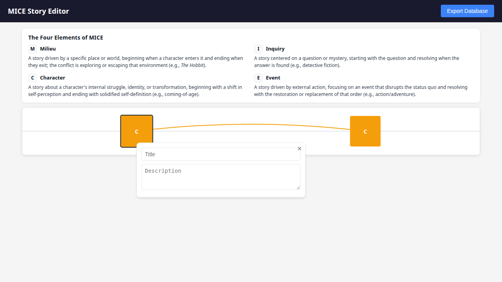
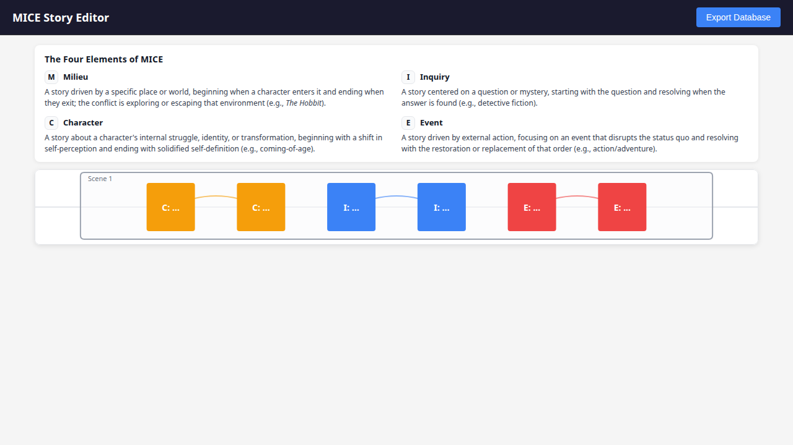

# MICE Storytelling Framework (App)

This app is a visual workspace for building stories using the **MICE Quotient** framing:

- **Milieu**: the world and its rules (enter when you cross into a place; exit when you leave it).
- **Idea**: a question, mystery, or investigation (enter when a question is posed; exit when it’s answered).
- **Character**: an internal arc of change (enter when a character’s flaw/need is in play; exit when it resolves).
- **Event**: external conflict and its consequences (enter when the central situation starts; exit when it ends).

The canvas is designed to make **nested arcs** and **interleaved threads** visible, so you can track where each thread starts, how it develops, and what “closes” it.

## Elite AI Assisted Coding

I created this app as homework for the "Context Engineering" section of the "Elite AI Assisted Coding" course on Maven.

My two takeaways from this project:

1. Settle on shared mental models and clarify shared vocabulary with your coding agents very early, or you get into failure modes where your agents don't understand what you want and you don't understand what they're doing because you're using words ambiguously or to mean different things.
2. Instead of writing a spec that lives separately from your tests, a powerful way to make sure you don't get deviations from spec is to make your tests and spec live together in the same place. In [.claude/skills/tdd/SKILL.md](.claude/skills/tdd/SKILL.md), I describe a framework for doing this that I call "TDD with integration stories". We describe user interaction flows end-to-end, with canonical natural language explanations of the expected UI behavior at each step, and I enforce that the agent can edit the test *code* freely but never the canonical intent text unless the user authorizes the change.

## Screenshots

Node selected:

Multiple threads:

